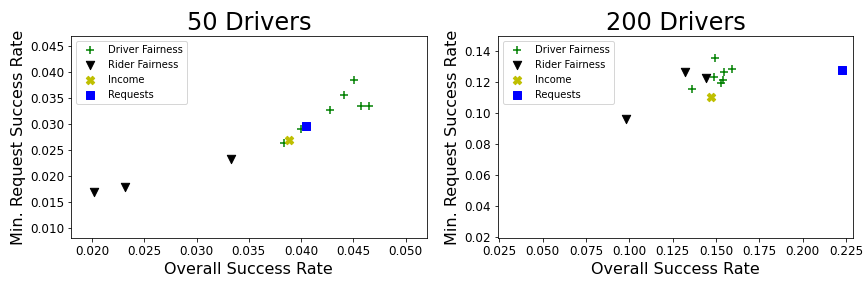
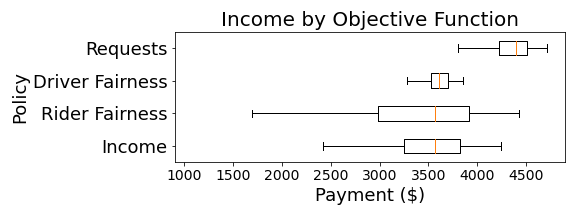
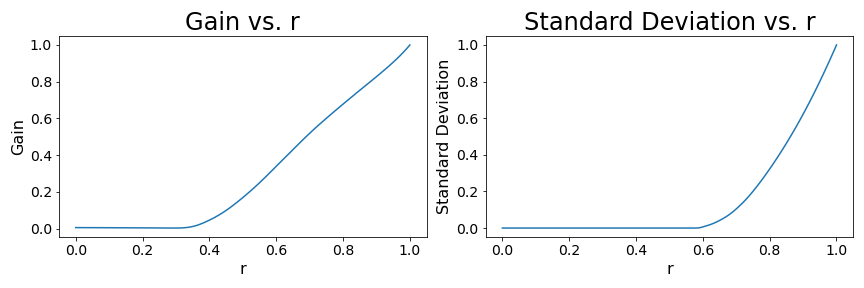

# FACT-AI-Group20_2022
This repository is dealing with reproducing the paper [Data-Driven Methods for Balancing Fairness and Efficiency in Ride-Pooling](https://arxiv.org/pdf/2110.03524.pdf). This implementation is based on the [official code](https://github.com/naveenr414/ijcai-rideshare).
 
## Requirements

### Setting up the environment
To setup the environment, install [anaconda](https://docs.conda.io/projects/conda/en/latest/user-guide/install/index.html) and run the following command while being at the root directory of this repository: 

```setup
conda env create -f fact.yml
```
If you want the environment with GPU support, run the following command instead:
```setup_gpu
conda env create -f fact_gpu.yml
```

### Downloading datasets
Create the subdirectory 'data' in the root directory of this repository. In order to provide the actual samples, the following datasets have to be downloaded.

#### Yellow taxi trip records
The [yellow taxi trip records](https://www1.nyc.gov/site/tlc/about/tlc-trip-record-data.page) dataset is used for the experiments. 
The preprocessed dataset can be requested from the authors of the original paper and has to be placed in 'data/ny'.

#### Demographics by Neighborhood Tabulation Area
Download the dataset [Demographics by Neighborhood Tabulation Area](https://www1.nyc.gov/site/dfta/news-reports/guide_to_community_and_neighborhood_resources.page) 
dataset and place it in 'data/demo'.

#### Coordinates of Neighborhood Tabulation Area
Download the dataset [Neighborhood Tabulation Areas (NTAs)](https://data.cityofnewyork.us/City-Government/2010-Neighborhood-Tabulation-Areas-NTAs-/cpf4-rkhq) 
dataset and place it in 'preprocessing'.

## Pre-trained Models

Our pretrained models are in the models subdirectory of this repository.

## Preprocessing, Training and Evaluation

The [jupyter notebook](https://jupyter.org/) run_experiments.ipynb in the folder 'src' provides an interface for preprocessing, training and evaluation. 
If pre-trained models are available they will be used to generate the results. The notebook can be opened by activating the environment:

```activate
conda activate fact
```

and executing:

```notebook
jupyter notebook
```

This opens a tab in the browser where the notebook file can be opened. By running all cells, our results can be obtained.

## Results

The following Figures show our reproduced results corresponding to Figures 1, 2 and 3 in the [original paper](https://arxiv.org/pdf/2110.03524.pdf).




